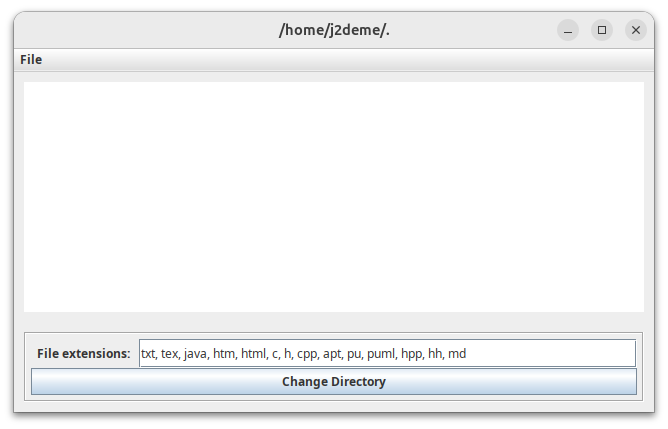
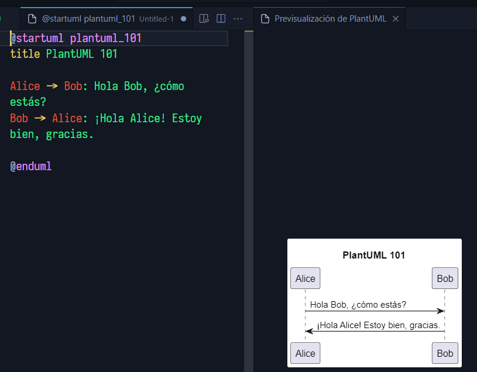
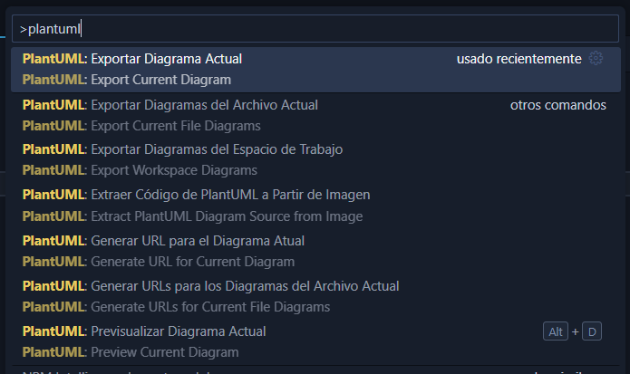

## Una breve introducción a UML

> El Lenguaje Unificado de Modelado (_UML_, por sus siglas en inglés) es un lenguaje estándar para la especificación, documentación, visualización y desarrollo de sistemas de software.

Es un lenguaje gráfico que permite modelar sistemas de software, desde la idea base hasta la implementación, fue en creado en 1997 por Grady Booch, Ivar Jacobson y James Rumbaugh, con el fin de unificar los métodos de modelado.

En ese mismo año, fue adoptado por el _Object Management Group_ (OMG) como un estándar y actualmente es el lenguaje de modelado más utilizado en el mundo, de hecho, es el único lenguaje de modelado que es un estándar de la _ISO_.

Desde 2004, es un estándar aprobado por la ISO como **ISO/IEC 19501:2005 Information Technology — Open Distributed Processing — Unified Modeling Language (UML)** para la versión 1.4.2; y en el 2012 se actualizó la norma a la última versión definitiva[^1] disponible en ese momento, la 2.5.1, dando lugar a las normas **ISO/IEC 19505-1:2012**.

[^1]: [ISO/IEC 19505-1:2012](https://www.iso.org/standard/52854.html) Tecnología de la información — Lenguaje de modelado unificado del grupo de gestión de objetos (OMG UML) - Parte 2: Superestructura

## Diagramas Soportados

UML soporta diversos tipos de diagramas[^2], entre los más comunes se encuentran:

- Diagrama de Clases
- Diagrama de Objetos
- Diagrama de Casos de Uso
- Diagrama de Secuencia
- Diagrama de Colaboración
- Diagrama de Estados
- Diagrama de Actividades
- Diagrama de Componentes
- Diagrama de Despliegue

Cada uno de estos diagramas tiene un propósito específico y se utiliza en diferentes etapas del desarrollo de software, por ejemplo, el diagrama de clases se utiliza en la etapa de análisis y diseño, mientras que el diagrama de secuencia se utiliza en la etapa de diseño y codificación.

<div class="info">
  <i class="ti ti-info-circle"></i>
  
  Este artículo **no** pretende ser una guía completa sobre UML, sino una introducción a los diagramas UML y cómo crearlos con PlantUML.
</div>

[^2]: [UML Diagrams](https://www.uml-diagrams.org/)

## Herramientas para Crear Diagramas UML

Existen diversas herramientas que permiten crear diagramas UML, algunas de ellas (aunque no se limitan a) son:

- [Lucidchart](https://www.lucidchart.com/)
- [Draw.io](https://app.diagrams.net/)
- [Visual Paradigm](https://www.visual-paradigm.com/)
- [PlantUML](https://plantuml.com/)

Propiamente no describiremos cada una de las herramientas mencionadas, ya que no es el objetivo de este artículo, pero si se desea, se puede consultar la documentación de cada una de ellas para obtener más información sobre sus características y funcionalidades.

Cabe mencionar que la mayoría de de las herramientas mencionadas, son principalmente herramientas gráficas que permiten crear diagramas UML de forma visual, arrastrando y soltando elementos en un lienzo, sin embargo, en esta ocasión, nos centraremos en PlantUML, una herramienta que permite crear diagramas UML de forma sencilla y rápida, utilizando un lenguaje de descripción de texto, que luego se convierte en un diagrama UML.

## PlantUML

PlantUML es una herramienta de código abierto que permite crear diagramas UML de forma sencilla y rápida, utilizando un lenguaje de descripción de texto, que luego se convierte en un diagrama UML, soporta diversos tipos de diagramas UML, como diagramas de clases, objetos, casos de uso, secuencia, colaboración, estados, actividades, componentes y despliegue.

Se basa en el lenguaje de descripción de texto [DOT](https://graphviz.gitlab.io/_pages/doc/info/lang.html), que es un lenguaje de descripción de gráficos desarrollado por AT&T, que se utiliza para describir gráficos de forma sencilla y rápida, utilizando un lenguaje de descripción de texto.

Una de sus principales ventajas es que no requiere de una interfaz gráfica para crear diagramas UML, lo que permite crear diagramas UML de forma sencilla y rápida, utilizando un editor de texto, como [Visual Studio Code](https://code.visualstudio.com/), [Sublime Text](https://www.sublimetext.com/), [Notepad++](https://notepad-plus-plus.org/), incluso desde la línea de comandos.

Lo anterior, permite integrar PlantUML en el flujo de trabajo de desarrollo de software, por ejemplo, se puede incluir el código PlantUML en un repositorio de código fuente, para que los desarrolladores puedan revisar y modificar los diagramas UML, como si se tratara de código fuente.

Permite exportar los diagramas UML a diversos formatos, como PNG, SVG, EPS, PDF, VDX, XMI, HTML, ASCII, entre otros, lo que facilita la integración de los diagramas UML en la documentación del software, como manuales de usuario, guías de instalación, informes técnicos, entre otros.

## ¿Como usar PlantUML?

Para poder utilizar PlantUML y su lenguaje de descripción de texto, tenemos varias opciones:

1. Utilizar [PlantText](https://www.planttext.com/), el cual es una herramient en línea que permite escribir el código PlantUML en un editor de texto y visualizar el diagrama UML en tiempo real, sin necesidad de instalar nada en nuestra computadora.
2. Instalar PlantUML en nuestra computadora, lo cual nos permitirá utilizar PlantUML desde la línea de comandos, para ello, necesitamos tener instalado [Java](https://www.java.com/), ya que PlantUML está escrito en Java.
3. Utilizar la extensión [PlantUML](https://marketplace.visualstudio.com/items?itemName=jebbs.plantuml) para Visual Studio Code, la cual nos permitirá escribir el código PlantUML en un editor de texto y visualizar el diagrama UML en tiempo real.

A continuación, revisaremos cada una de estas opciones, para que puedas elegir la que mejor se adapte a tus necesidades.

<div class="info">
  <i class="ti ti-info-circle"></i>

Las descripciones e instrucciones que se presentan a continuación, corresponden a la fecha de publicación de este artículo, por lo que es posible que cambien con el tiempo, sin embargo, pueden servir como referencia para futuras versiones de PlantUML y sus herramientas relacionadas.

</div>

Utilizaremos un ejemplo de diagrama de clases en PlantUML, que nos servirá para representar la relación entre un `Carro`, un `Motor` y una `Llanta`.

```plantuml caption="Ejemplo de Diagrama de Clases en PlantUML" showLineNumbers
@startuml
class Carro
class Motor
class Llanta

Carro *- Motor
Carro *- Llanta
@enduml
```

### 1. En línea con PlantText

PlantText es una herramienta en línea que permite escribir el código PlantUML en un editor de texto y visualizar el diagrama UML en tiempo real, sin necesidad de instalar nada en nuestra computadora, para ello, solo necesitamos un navegador web y una conexión a Internet.

Esta es la forma más sencilla de utilizar PlantUML, ya que no requiere de ninguna instalación, solo necesitamos abrir el navegador web, acceder a la página de PlantText, escribir el código PlantUML en el editor de texto y visualizar el diagrama UML en tiempo real.

| Ventajas ✅                  | Desventajas ❌                             |
| ---------------------------- | ------------------------------------------ |
| No requiere instalación      | Requiere conexión a Internet               |
| Interfaz fácil de usar       | Sólo soporta exportación a PNG, SVG y TXT  |
| Visualización en tiempo real | Sólo soporta exportar un diagrama a la vez |

Para utilizar PlantText, solo necesitamos seguir los siguientes pasos:

1. Abrir el navegador web de nuestra preferencia, aunque se recomienda utilizar [Google Chrome](https://www.google.com/chrome/).
2. Acceder a la página de **PlantText**: [https://www.planttext.com/](https://www.planttext.com/).
3. Crear una cuenta en PlantText, si deseamos guardar los diagramas UML en la nube (Opcional).

   - No es necesario crear una cuenta para utilizar PlantText, ya que podemos guardar los diagramas UML en nuestra computadora, pero es muy útil si deseamos guardar los diagramas UML en la nube y acceder a ellos desde cualquier dispositivo.

4. Escribir el código PlantUML en el editor de texto **Ó** cargar un archivo PlantUML desde tu computadora o la nube **Ó** seleccionar un ejemplo de PlantUML para visualizar o modificar.
5. Activar las opciones `Refresh` y `Scale` para visualizar el diagrama UML en tiempo real y que el diagrama UML se ajuste al tamaño de la ventana del navegador.
6. Una vez que hemos terminado nuestro diagrama, podemos exportarlo a PNG, SVG o TXT, o guardar el código fuente en nuestra cuenta de PlantText (o en un archivo local) para futuras modificaciones.

Esta opción es ideal para aquellos que desean utilizar PlantUML de forma rápida y sencilla, sin necesidad de instalar nada en su computadora, y para aquellos que desean visualizar los diagramas UML en tiempo real.

### 2. En la Línea de Comandos con PlantUML

PlantUML se puede instalar en nuestra computadora, lo cual nos permitirá utilizar PlantUML desde la línea de comandos, para ello, necesitamos tener instalado [Java](https://www.java.com/), ya que PlantUML está escrito en Java.

Esta es una forma más avanzada de utilizar PlantUML, ya que requiere de una instalación previa, pero nos permite integrar PlantUML en el flujo de trabajo de desarrollo de software, por ejemplo, podemos incluir el código PlantUML en un repositorio de código fuente, para que los desarrolladores puedan revisar y modificar los diagramas UML, como si se tratara de código fuente.

Adicionalmente, no requiere de una conexión a Internet, lo que nos permite utilizar PlantUML en entornos sin conexión, como servidores locales o entornos aislados.

| Ventajas ✅                             | Desventajas ❌                                         |
| --------------------------------------- | ------------------------------------------------------ |
| No requiere conexión a Internet         | Requiere instalación previa de Java y PlantUML         |
| Integración en el flujo de trabajo      | Requiere conocimientos básicos de la línea de comandos |
| Soporta exportación a diversos formatos | No soporta visualización en tiempo real                |
| Soporta múltiples diagramas a la vez    | Interfaz basada en la línea de comandos                |

Para instalar PlantUML en nuestra computadora, solo necesitamos seguir los siguientes pasos:

1. Descargar la última versión de PlantUML desde la página oficial de PlantUML ([https://plantuml.com/download](https://plantuml.com/download)), elegiremos la versión **GPL**, en formato JAR (_Compiled JAR_).

   - Se sugiere guardar el archivo JAR en una carpeta de fácil acceso, como el escritorio o la carpeta de descargas, para facilitar su uso posterior.

2. Instalar [Java](https://www.java.com/), si no lo tenemos instalado en nuestra computadora, ya que PlantUML está escrito en Java y lo requiere para ejecutarse.
3. Utilizando el editor de texto de nuestra preferencia, desarrollaremos el / los diagramas UML que deseamos convertir, almacenando cada uno de ellos en un archivo con extensión `.puml` (**P**lant**UML**).
4. Una vez que hayamos terminado de editar nuestros diagramas, abriremos una terminal o línea de comandos en nuestra computadora y ejecutaremos el siguiente comando para verificar que Java esté instalado correctamente:

   ```bash
   java -version
   ```

   - Si Java está instalado correctamente, veremos la versión de Java instalada en nuestra computadora, de lo contrario, necesitamos instalar Java antes de continuar.

5. Desde la línea de comandos, nos desplazaremos a la carpeta donde guardamos el archivo JAR de PlantUML y ejecutaremos el siguiente comando:

   ```bash
   java -jar plantuml.jar
   ```

   - Donde `plantuml.jar` es el archivo JAR de PlantUML que descargamos anteriormente (el nombre puede variar ligeramente incluyendo la versión del JAR), este comando iniciará PlantUML y nos mostrará una pantalla similar a la siguiente:
     

6. En la pantalla que se muestra, daremos click en el botón `Change Directory`, para seleccionar la carpeta donde tenemos nuestros archivos `.puml`, esto nos permitirá cargar los archivos para su conversión.
7. Es importante mencionar que mientras la aplicación este activa, cada cambio que hagamos y guardemos, generará automáticamente el diagrama UML correspondiente, de la misma manera, si añadimos nuevos diagramas a la carpeta que tenemos activa; de esta manera, podemos visualizar y exportar los diagramas UML, prácticamente en tiempo real, de forma masiva y automática.

<div class="info">
  <i class="ti ti-info-circle"></i>

Por default, una vez seleccionada la carpeta, PlantUML buscará todos los archivos `.puml` en la carpeta seleccionada y los convertirá en diagramas UML en formato PNG, de forma automática.

</div>

Es posible que no necesitemos regenerar todos los diagramas de nuestra carpeta, cada que usemos la aplicación de PlantUML o que necesitemos exportar alguno de nuestros diagramas en un formato distinto.

Para ello, podemos especificar el archivo que deseamos convertir, utilizando el siguiente comando:

```bash
java -jar plantuml.jar -tpng diagrama.uml
```

- Donde `plantuml.jar` es el archivo JAR de PlantUML que descargamos anteriormente, `diagrama.uml` es el archivo PlantUML que deseamos convertir y `-tpng` es la opción que indica que deseamos convertir el archivo a formato PNG, si deseamos convertirlo a otro formato, podemos utilizar las opciones `-tsvg`, `-teps`, `-tpdf`, `-tvdx`, `-txmi`, `-thtml`, `-tascii`, entre otros.

### 3. En VS Code con la extensión PlantUML

PlantUML también se puede utilizar en Visual Studio Code, utilizando la extensión [PlantUML](https://marketplace.visualstudio.com/items?itemName=jebbs.plantuml), la cual nos permitirá escribir el código PlantUML en un editor de texto y visualizar el diagrama UML en tiempo real.

Esta es una forma intermedia de utilizar PlantUML, ya que requiere de una instalación previa de Visual Studio Code y la extensión PlantUML, pero nos permite integrar PlantUML en nuestro flujo de trabajo de desarrollo de software, sin tener que preocuparnos mucho por la implementación.

| Ventajas ✅                             | Desventajas ❌                                          |
| --------------------------------------- | ------------------------------------------------------- |
| Integración en el flujo de trabajo      | Requiere instalación previa de Visual Studio Code       |
| Soporta exportación a diversos formatos | Requiere instalar un plugin al entorno de trabajo       |
| Soporta múltiples diagramas a la vez    | Requiere conexión a Internet para generar los diagramas |
| Visualización en tiempo real            |                                                         |

En general, esta es una opción muy útil para aquellos que desean utilizar PlantUML en su flujo de trabajo de desarrollo de software, sin tener que preocuparse por la instalación y configuración de PlantUML, ya que la extensión PlantUML se encarga de todo.

Para utilizar PlantUML en Visual Studio Code, solo necesitamos seguir los siguientes pasos:

1. Abrir Visual Studio Code en nuestra computadora, si no lo tenemos instalado, podemos descargarlo desde la página oficial de Visual Studio Code ([https://code.visualstudio.com/](https://code.visualstudio.com/)).
2. Instalar la extensión PlantUML en VS Code, para ello, abriremos VS Code, nos dirigiremos a la pestaña de extensiones y buscaremos la extensión PlantUML, la instalaremos y reiniciaremos Visual Studio Code.
3. Crear un nuevo archivo en VS Code, con la extensión `.puml` (**P**lant**UML**).
4. Escribir el código PlantUML en el editor de texto de VS Code, podemos tomar como referencia el ejemplo de diagrama de clases que mencionamos anteriormente o crear nuestro propio diagrama UML.
5. Para visualizar el diagrama UML en tiempo real, podemos utilizar la opción `Preview` que nos proporciona la extensión PlantUML, esta opción nos mostrará el diagrama, al lado del código PlantUML, puede activarse presionando `Alt + D` o seleccionando la opción `PlantUML: Preview` desde el menú de comandos de Visual Studio Code.
   

6. Podemos exportar el diagrama UML a diversos formatos, como PNG, SVG, EPS, PDF, VDX, XMI, HTML, ASCII, entre otros, utilizando la opción `Export` que nos proporciona la extensión PlantUML, ya sea a través del menú de comandos de VS Code (`Ctrl + Shift + P`) o del menú contextual del editor de texto y seleccionando la opción `PlantUML: Export Current Diagram` o `PlantUML: Export Current File Diagrams`, según sea el caso.
   

## Conclusión

Entonces, ¿cuál es la mejor forma de utilizar PlantUML? La respuesta depende de tus necesidades y preferencias, si deseas utilizar PlantUML de forma rápida y sencilla, sin necesidad de instalar nada en tu computadora, entonces PlantText es la mejor opción para ti.

Si por otro lado, deseas integrar PlantUML en tu flujo de trabajo de desarrollo de software, sin tener que preocuparte por la instalación y configuración de PlantUML, entonces la extensión PlantUML para Visual Studio Code es una excelente opción.

Finalmente, si deseas utilizar PlantUML en entornos sin conexión a Internet, como servidores locales o entornos aislados, donde se requiera la exportación masiva de diagramas con la menor intervención posible, entonces la instalación de PlantUML en tu computadora es la mejor opción para ti, ya que te permitirá utilizar PlantUML desde la línea de comandos y exportar los diagramas UML a diversos formatos, de forma rápida y sencilla.

En resumen, PlantUML es una excelente herramienta para crear diagramas UML de forma sencilla y rápida, a través de un lenguaje de descripción de texto, que luego se convierte en un diagrama UML, soporta diversos tipos de diagramas UML, como diagramas de clases, objetos, casos de uso, secuencia, colaboración, estados, actividades, componentes y despliegue, y se puede utilizar en línea, en la línea de comandos o en Visual Studio Code, todo según tus necesidades y preferencias.
